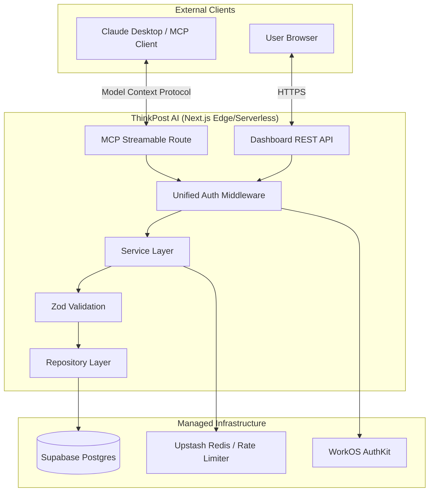

<div align="center">
  <br />
  <div style="background: linear-gradient(135deg, #6366f1 0%, #9333ea 100%); padding: 2px; border-radius: 16px; display: inline-block;">
    <div style="background: #111827; padding: 20px 24px; border-radius: 14px; font-weight: 800; font-size: 32px; color: white;">
      TP
    </div>
  </div>
  <br />
  <br />
  <h1>ThinkPost AI</h1>
  <p>
    <strong>The Enterprise Context Provider for AI Agents</strong>
  </p>
  <p>
    Provide Large Language Models with your professional identity, style rules, and granular memories via the <b>Model Context Protocol (MCP)</b>. Generate hyper-personalized content, seamlessly.
  </p>

  <p>
    <a href="https://modelcontextprotocol.io/"></a>
    <a href="https://nextjs.org/"></a>
    <a href="https://www.typescriptlang.org/"></a>
    <a href="https://workos.com/"></a>
    <a href="LICENSE"></a>
  </p>
</div>

---

## ⚡ Overview

Generic AI outputs are a thing of the past. **ThinkPost AI** bridges the gap between your unique professional identity and modern AI agents (like Claude Desktop). 

By acting as a centralized, secure knowledge base, ThinkPost AI feeds LLMs exactly what they need to write *as you*—including your career history, preferred tone, formatting quirks, and categorized memories. All managed through a beautiful, dark-mode web dashboard.

---

## ✨ Enterprise-Grade Features

* **Identity Hub:** Centralize your professional headline, bio, and structured experience.
* **Granular Style Enforcement:** Define tone, length limits, emoji preferences, and CTA structures. AI models are forced to adhere to these guardrails.
* **Semantic Memories:** Categorized facts, topics, and nuances. AI agents selectively pull the memories relevant to the post they are writing.
* **Draft Pipeline:** Let agents write drafts autonomously. Review, approve, or archive them via the ThinkPost dashboard.
* **Zero-Trust Access:** Strict Read-Only modes ensure AI clients can never overwrite your core identity without explicit permission.
* **Streamable HTTP Transport:** Industry-standard MCP integration using stateless, high-throughput HTTP streaming.

---

## 🏗 Architecture

ThinkPost AI is built on a modern, horizontally scalable stack designed for edge performance and strict type safety.



---

## 🚀 Quick Start

Get your local environment running in less than 5 minutes.

### 1. Requirements
* **Node.js** ≥ 18
* **npm** ≥ 9

### 2. Configure Infrastructure
ThinkPost relies on Supabase (Database) and WorkOS (Auth). 
👉 **Follow the [Infrastructure Setup Guide (SETUP.md)](./SETUP.md)** to provision these free-tier services.

### 3. Installation
Clone the repository, copy the environment template, and install dependencies.

```bash
git clone https://github.com/your-org/thinkpost-ai.git
cd thinkpost-ai

# Copy environment variables and populate with your keys
cp .env.local.example .env.local

# Install dependencies
npm install
```

### 4. Development Server
Start the Next.js development server:

```bash
npm run dev
```

Navigate to `http://localhost:3000` to access the dashboard.

---

## 🛠 Available MCP Tools

Once connected to an MCP client, the following tools are exposed to the AI agent:

| Tool | Action | Access |
| :--- | :--- | :--- |
| `get_post_context` | Fetches profile, style, and recent memories in one payload. | Read |
| `get_profile` | Retrieves detailed professional background. | Read |
| `update_profile` | Patches profile fields (requires write-access). | Write |
| `get_writing_style` | Retrieves tone, length, and formatting rules. | Read |
| `update_writing_style` | Modifies writing guidelines (requires write-access). | Write |
| `get_memories` | Queries semantic facts, optionally filtered by category. | Read |
| `list_posts` | Returns a paginated list of drafts. | Read |
| `save_post` | Commits an AI-generated draft to the database. | Write |

---

## 🔒 Security & Privacy

* **No RLS Dependencies:** All data security is enforced strictly at the Service Layer.
* **Rate Limiting:** Global Upstash Redis rate-limiting (60 requests/minute per tool/user).
* **Isolated Staging:** Vercel preview deployments are strictly cordoned into a separate Supabase project.

---

## 📄 License

ThinkPost AI is released under the [MIT License](LICENSE).

<br />
<div align="center">
  <sub>Built for the future of agentic AI.</sub>
</div>
